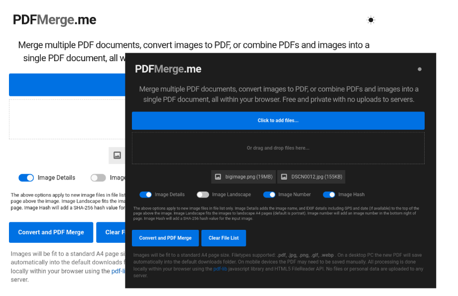

# PDFMerge

PDFMerge is a versatile web-based tool developed using JavaScript, HTML, and CSS, designed to merge PDFs and images into a single PDF document. Ideal for professionals, students, and anyone needing a reliable PDF merging solution, this tool processes files entirely on the client side, ensuring data privacy and eliminating the need for server uploads. Built on the robust [PDF-LIB.js](https://pdf-lib.js.org/) library, PDFMerge offers efficient PDF generation and manipulation. It also leverages the HTML5 FileReader API for image handling, with the option to include the original filename, SHA256 hash, and basic GPS and date EXIF details from photos at the top of each image page, thanks to [ExifReader](https://github.com/mattiasw/ExifReader).

### Try it out at [pdfmerge.me](https://pdfmerge.me)

## Features
- **User-Friendly Interface**: Merge PDFs and images with ease.
- **File Support**: Works with `.jpg`, `.jpeg`, `.png`, and `.pdf`.
- **Optimisation**: Resize and optimise images for reduced PDF file size.
- **Privacy Focused**: Local processing for enhanced data privacy and control.

## Getting Started
To use PDFMerge, simply visit [pdfmerge.me](https://pdfmerge.me) and upload your PDFs and images. The intuitive interface will guide you through the merging process. No installation or setup required!

## Screenshots

*PDFMerge in action*

## Known Limitations

- **In-Browser Processing Constraints:** PDFMerge operates entirely within your browser, leveraging client-side resources. While this ensures data privacy and negates server-side data transfer, it does mean that the tool's performance is inherently tied to the capabilities of the user's device and browser. Particularly, handling very large files can lead to performance bottlenecks.

- **Maximum Image Size Limitation:** To optimise performance and ensure a smooth user experience, PDFMerge imposes a file size limitation on images. The maximum allowable size for any image file is 30MB. This constraint helps prevent excessive memory usage and potential browser crashes, especially when dealing with high-resolution images. Users attempting to upload images larger than 30MB will receive an informative error message.

It's recommended to pre-process larger images using external tools to reduce their file size before merging them into a PDF using PDFMerge.

## Credits and Third-Party Licensing
- **PDF-LIB.js** by Andrew-Dillon | [MIT License](https://opensource.org/licenses/MIT)
- **ExifReader** by Mattias Wallander | [MPL-2.0 license](https://www.mozilla.org/en-US/MPL/2.0/)
- **Roboto Regular Font** by Christian Robertson | [Apache License, Version 2.0](https://www.apache.org/licenses/LICENSE-2.0)

